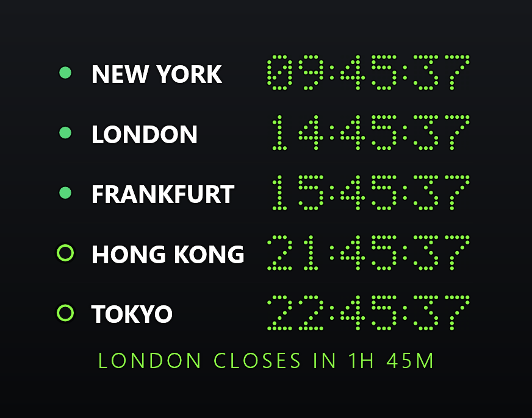
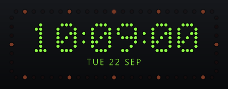
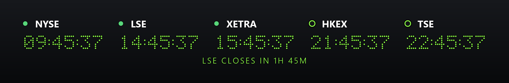
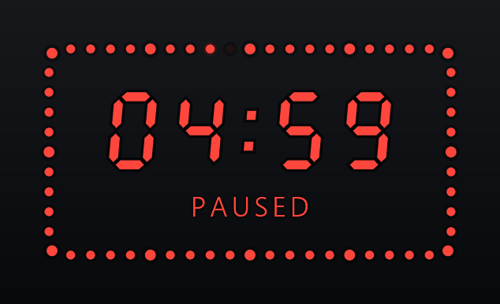
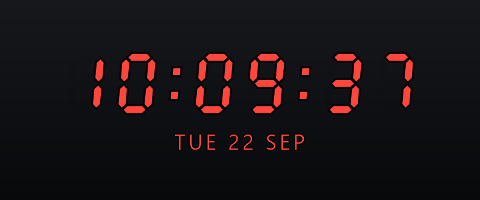
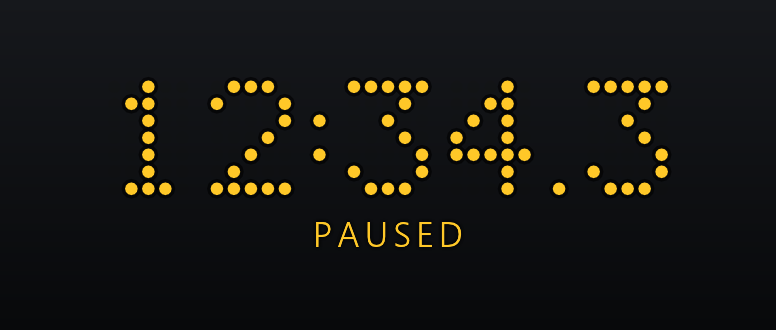

# ChronoDesk

A small, transparent always-on-top clock for the Windows desktop, styled after studio and trading-floor
hardware clocks: a clock, a stopwatch, a countdown timer and a **world market board** that shows which
stock exchanges are open right now.

<p align="center">
  
  
</p>
<p align="center">
  
</p>
<p align="center">
  
  
  
</p>

- **Market board:** local time and trading status for nine exchanges from New York to Sydney,
  with a countdown to the next open or close. Computed locally, with no network access and no
  account.
- **Hardware looks:** dot-matrix or seven-segment LED faces with ghosted unlit segments, a studio
  seconds ring with sixty LEDs, and industrial colour presets (green, red, yellow, studio green/red).
- **Stays out of the way:** click-through lock, night dimming, chroma-key background for streaming,
  a stopwatch or timer that survives a reboot, and a chime when the timer runs out.
- **Light:** one ~5.8 MB exe with no assets, ~50 MB RAM, one frame per second when idle. No admin
  rights, no telemetry. The only network use is one request a day to see if there is a new release,
  which can be switched off.

**Windows 10 and 11 only** for now.

## Install

Download from the [latest release](../../releases/latest):

- **`ChronoDesk-Setup.exe`** installs the app. It copies itself to `%LOCALAPPDATA%\ChronoDesk`,
  adds a Start menu shortcut and an entry under *Installed apps*, and starts the overlay. It does
  not need administrator rights.
- **`ChronoDesk.exe`** is the portable version. Put it anywhere and run it; nothing is installed.

Both are the same program. `SHA256SUMS.txt` lists their checksums.

To uninstall, use *Settings → Apps → Installed apps*, or run `chronodesk.exe --uninstall`. Your
settings in `%APPDATA%\chronodesk` are left in place.

The exes are not code-signed yet, so Windows SmartScreen may warn about an unrecognised app. Choose
*More info → Run anyway*.

### Updates

Once a day ChronoDesk asks GitHub which release is the latest. When there is a newer one, the tray
icon gets a green dot and the menu starts with *Update to ChronoDesk x.y.z now*. Clicking it
downloads the new setup, checks it and installs it: the overlay closes and the new version starts
in its place, with your settings. Nothing is downloaded until you click.

Every release is signed with a key that is kept offline, not on GitHub, and the app installs an
update only when its signature and checksum match. If they do not, or you use the portable exe,
the item opens the release page instead, to download the setup by hand.

The daily request goes to `github.com/superhelten/chronodesk/releases/latest` and sends nothing but
the app's name and version. It can be switched off under *Check for updates* in the menu. You can
also watch the repository on GitHub (*Watch → Custom → Releases*) to hear about new versions by
e-mail; versions before 0.2.0 do not check by themselves.

## Using it

Right-click the overlay or the tray icon to open the menu. Everything can be set from there.

| Action | How |
| --- | --- |
| Move | Drag with the left mouse button |
| Lock (click-through) | Left-click the tray icon. The icon turns amber while locked, and a second click unlocks |
| Switch mode | Menu, or `1` Clock, `2` Stopwatch, `3` Timer, `4` Markets |
| Start/pause, reset | Hover the stopwatch or timer, or click the overlay and press `Space` / `R` |
| Timer duration | Menu → *Timer duration*, or scroll over a stopped timer |
| Start with Windows | Menu → *Start with Windows* |

When a countdown finishes, the digits blink for half a minute and the Windows notification sound
plays three times; *Restart* runs it again from the top. A running stopwatch or timer carries on after a restart or a reboot.

Under *Appearance* you can change the size, the face (typeface, seven-segment or dot matrix), the
colours, the 12/24-hour format, the date line, the seconds ring and night mode, which dims the
readout on a schedule. *Chroma key background* fills the window with pure green for use as a
source in streaming software. Over the key the green presets are drawn in white, because a
keyer would remove the lime along with the background.

### Market board

The *Markets* mode shows one row per exchange with its local time and a status dot: green while
trading, amber during a lunch break, hollow when closed. The line underneath says what happens
next, such as "London closes in 1h 45m".

The built-in exchanges are New York, London, Oslo, Frankfurt, Mumbai, Shanghai, Hong Kong, Tokyo
and Sydney. The board starts with New York, London, Frankfurt, Hong Kong and Tokyo; choose
which ones to show under *Exchanges*, where you can also lay the board out on
one line and show exchange codes (NYSE, LSE, OSE…) instead of city names.

Opening hours are regular weekday sessions, including lunch breaks, with daylight saving time
handled for each region. **Public holidays and half days are not included**, so on a holiday the
board will show an exchange as open.

## Configuration

Settings are saved to `%APPDATA%\chronodesk\data\app.ron`, a plain text file that can be edited by
hand while the app is closed. Set the `CHRONODESK_CONFIG` environment variable to use a different
file. If a value is invalid, that one setting falls back to its default and the rest are kept.

| Key | Values |
| --- | --- |
| `mode` | `"clock"`, `"stopwatch"`, `"timer"`, `"market"` |
| `size` | `"small"`, `"medium"`, `"large"` |
| `font` | `"sans"`, `"digital"` (seven-segment), `"matrix"` |
| `palette` | `"default"`, `"warm"`, `"cool"`, `"amber"`, `"green"`, `"red"`, `"yellow"`, `"studio"` |
| `clock_format` | `"24h"`, `"12h"` |
| `show_seconds`, `show_date`, `seconds_ring` | `true` / `false` |
| `backdrop`, `chroma`, `text_outline`, `always_on_top` | `true` / `false` |
| `timer_minutes` | 1 to 1440 |
| `timer_sound` | `true` / `false` |
| `night` | `"off"`, `"on"`, `"auto"` |
| `night_from`, `night_to` | `"HH:MM"`, used by `"auto"` (default 22:00 to 07:00) |
| `night_dim` | 0.6 to 1.0 |
| `check_updates` | `true` / `false`: the daily check for a new release |
| `markets` | exchange ids in display order: `"new-york"`, `"london"`, `"oslo"`, `"frankfurt"`, `"mumbai"`, `"shanghai"`, `"hong-kong"`, `"tokyo"`, `"sydney"` |
| `board_layout` | `"vertical"`, `"horizontal"` |
| `board_labels` | `"city"`, `"code"` |

The file also holds the window position, the state of a running stopwatch or timer and the last
update check, which the app manages itself.

## Building

Requires Rust 1.95 or newer.

```sh
cargo run --release              # build and run the overlay
cargo test                       # unit tests
pwsh -File scripts/package.ps1   # dist\: setup and portable exe, SHA256SUMS.txt
```

The scripts in `scripts/` test the running app end to end. They need a build with
`--features instrument`, which lets them drive the app over a local connection instead of moving
the real mouse; a normal build contains none of this. Each script runs against its own config file
and leaves an overlay you already have running alone.

| Script | Checks |
| --- | --- |
| `instrument-test.ps1` | frame rate in each mode, hover controls, layout caching |
| `placement-test.ps1` | a saved position outside every screen is moved back into view |
| `lifecycle-test.ps1` | one instance per config file, *Start with Windows* |
| `install-test.ps1` | install, upgrade and uninstall into a scratch folder and registry key |
| `welcome-test.ps1` | the welcome card on first launch |
| `resume-test.ps1` | a running stopwatch or timer survives the app being killed |
| `chime-test.ps1` | the timer chime (counted, not played) |

Run them with PowerShell 7 (`pwsh`).

### Releasing

Push a tag `vX.Y.Z` matching the version in `Cargo.toml`; the release workflow builds the exes and
publishes them with `SHA256SUMS.txt`. Then sign the release on the machine that holds the signing
key, which the app needs before it installs the update by itself:

```sh
pwsh -File scripts/sign-release.ps1 -Tag vX.Y.Z   # checks the published files, uploads SHA256SUMS.txt.sig
```

The key never goes to GitHub or CI. `-Init` creates it and prints the public half that
`src/update.rs` carries.

### Screenshots

The images in `docs/screenshots` are rendered by the app itself with the clock pinned to a fixed
time, so they can be regenerated after a visual change:

```sh
cargo test shots -- --ignored        # renders to target/shots
python scripts/compose-shots.py      # composes docs/screenshots (needs Pillow)
```

## How it works

[docs/architecture.md](docs/architecture.md) explains how the app is built and why: how settings
are stored, when it redraws, how the market hours are computed without a time zone database, and
how installing and single-instance handling work.

## License

MIT, see [LICENSE](LICENSE).
