# ChronoDesk

A small, transparent always-on-top clock for the Windows desktop, styled after studio and trading-floor
hardware clocks: a clock, a stopwatch, a countdown timer and a **world market board** that shows which
stock exchanges are open right now.

**[Download for Windows](https://github.com/superhelten/chronodesk/releases/latest/download/ChronoDesk-Setup.exe)**
· [Website](https://superhelten.github.io/chronodesk/) · [All releases](../../releases)

<p align="center">
  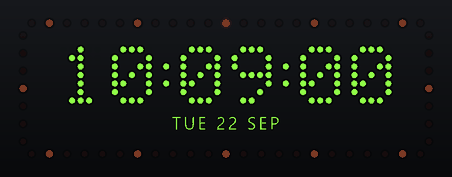
  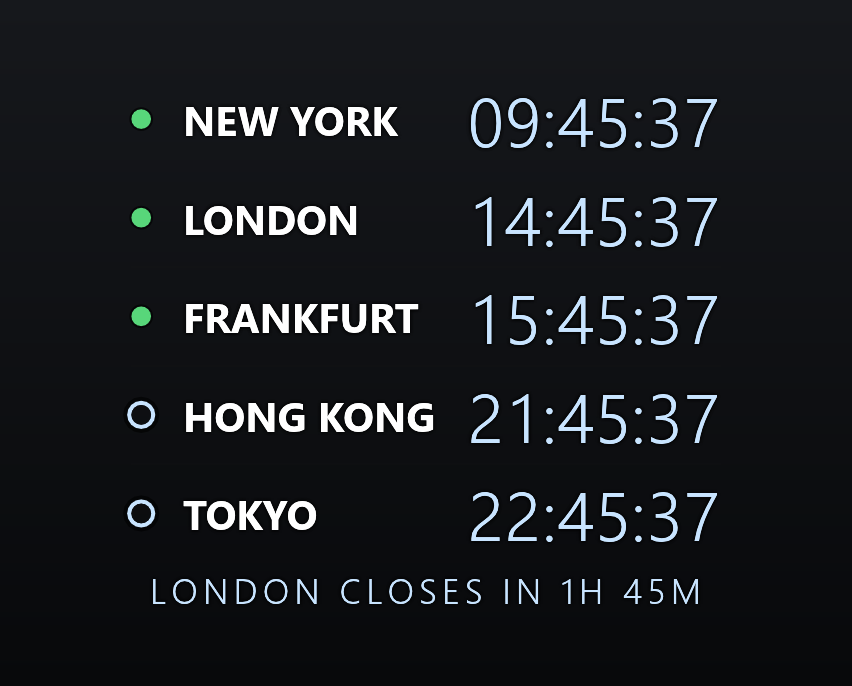
</p>

- **Market board:** local time and trading status for nine exchanges from New York to Sydney,
  with a countdown to the next open or close. Computed on your PC, with no network and no account.
- **Clock and timers:** a second time zone after the date, a one-shot alarm, and a Pomodoro cycle
  on the timer.
- **Hardware looks:** three faces (dot-matrix and seven-segment LEDs, or a plain typeface), eight
  colour presets, a studio seconds ring with sixty LEDs and an optional dark backdrop.
- **Stays out of the way:** click-through lock with hotkeys that still reach it, night dimming,
  a chroma-key background for streaming, and a stopwatch or timer that survives a reboot.
- **Light:** one ~5.8 MB exe, ~50 MB RAM, one frame per second when idle. No admin rights, no
  telemetry.

**Windows 10 and 11 only** for now.

## Install

Download from the [latest release](../../releases/latest):

- **`ChronoDesk-Setup.exe`** installs the app for your user in `%LOCALAPPDATA%\ChronoDesk`, adds a
  Start menu shortcut and an entry under *Installed apps*, and starts it. No administrator rights
  needed.
- **`ChronoDesk.exe`** is the same program as a portable exe: run it from anywhere, nothing is
  installed.

The exes are not code-signed, so Windows SmartScreen may warn the first time. Choose
*More info → Run anyway*. `SHA256SUMS.txt` in the release lists their checksums.

To uninstall, use *Settings → Apps → Installed apps*, or run `chronodesk.exe --uninstall`. Your
settings in `%APPDATA%\chronodesk` are left in place.

### Updates

Once a day ChronoDesk asks GitHub whether there is a newer release, sending nothing but its name
and version. When there is, the tray icon gets a green dot and the menu offers *Update to
ChronoDesk x.y.z now*: one click downloads it, checks its signature and installs it, keeping your
settings. Nothing downloads until you click, and the portable exe opens the release page instead.
Switch the check off under *Check for updates*. The item below it shows which version you have;
click it to check straight away.

## Using it

Right-click the overlay or the tray icon to open the menu. Everything can be set from there.

| Action | How |
| --- | --- |
| Move | Drag with the left mouse button |
| Lock (click-through) | Left-click the tray icon. The icon turns amber while locked, and a second click unlocks |
| Switch mode | Menu, or `1` Clock, `2` Stopwatch, `3` Timer, `4` Markets |
| Start/pause, reset | Hover the stopwatch or timer, or click the overlay and press `Space` / `R` |
| From any window | `Ctrl+Alt+Shift` with `Space`, `R`, `1`–`4`, or `L` to lock and unlock. Works while locked; switch off under *Global hotkeys* |
| Timer duration | Menu → *Timer duration*, or scroll over a stopped timer |
| Alarm | Menu → *Alarm*: pick the hour and minute, or switch it on and off |
| Start with Windows | Menu → *Start with Windows* |

When a countdown finishes, the digits blink for half a minute and the Windows notification sound
plays three times; *Restart* runs it again. A running stopwatch or timer carries on after a restart
or a reboot.

*Timer duration → Pomodoro cycle* turns the timer into four focus periods, with a short break after
each of the first three and a long one after the fourth (5 and 15 minutes at 25-minute focus; they
scale with other durations). A finished period waits for *Start*. *Reset* restarts the period, and
pressed again, the whole cycle.

The alarm rings once, at the next time the clock shows the hour and minute you picked: three chimes
ten seconds apart and a blinking frame. A click, a key or any menu choice silences it. If the PC is
asleep or the overlay is closed at that moment, it does not ring late.

<p align="center">
  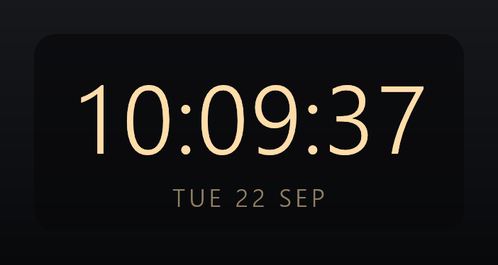
  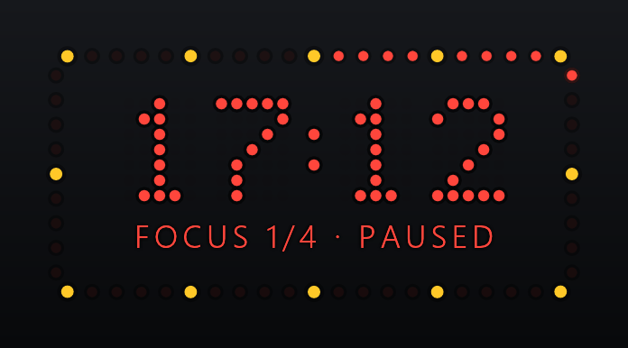
  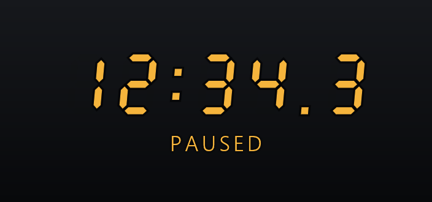
</p>

Under *Appearance* you can change the size, the face (typeface, seven-segment or dot matrix), the
eight colour presets, the 12/24-hour format, the date line, the seconds ring, the backdrop and
night mode, which dims the readout on a schedule.

*Second time zone* adds another city's time after the date, such as "TOKYO 03:30 +1", marked when
its date differs from yours. *Chroma key background* fills the window with pure green for streaming
software; the green presets are then drawn in white, since the keyer would remove them too.

<p align="center">
  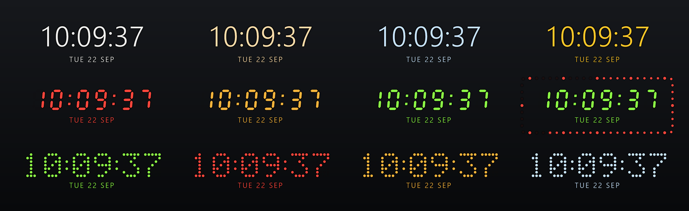
</p>
<p align="center">
  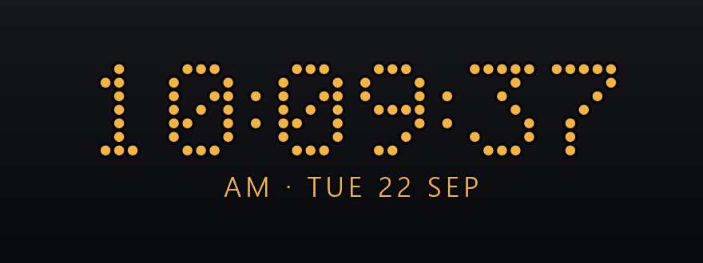
  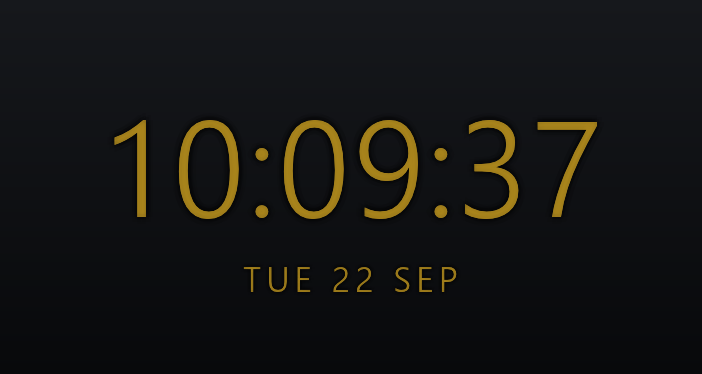
  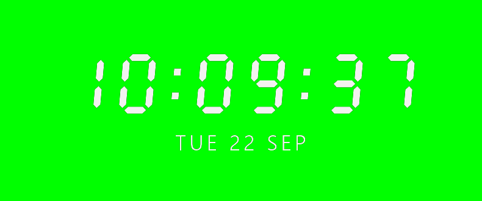
  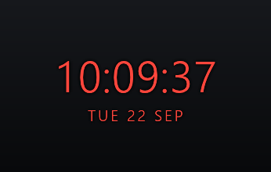
</p>

Every combination of face, colour, ring and backdrop is on the
[website](https://superhelten.github.io/chronodesk/#skins).

### Market board

The *Markets* mode shows one row per exchange with its local time and a status dot: green while
trading, amber during a lunch break, hollow when closed. The line underneath says what happens
next, such as "London closes in 1h 45m".

The built-in exchanges are New York, London, Oslo, Frankfurt, Mumbai, Shanghai, Hong Kong, Tokyo
and Sydney. The board starts with New York, London, Frankfurt, Hong Kong and Tokyo; choose which
ones to show under *Exchanges*, where you can also put the board on one line and show exchange
codes (NYSE, LSE, OSE…) instead of city names.

Opening hours are regular weekday sessions, including lunch breaks, with daylight saving time
handled for each region. **Public holidays and half days are not included**, so on a holiday the
board will show an exchange as open.

<p align="center">
  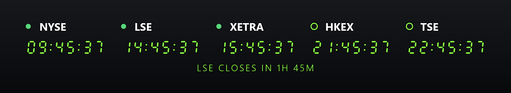
</p>

## Configuration

Settings are saved to `%APPDATA%\chronodesk\data\app.ron`, a plain text file that can be edited by
hand while the app is closed. Set the `CHRONODESK_CONFIG` environment variable to use a different
file. If a value is invalid, that one setting falls back to its default and the rest are kept.

| Key | Values |
| --- | --- |
| `mode` | `"clock"`, `"stopwatch"`, `"timer"`, `"market"` |
| `size` | `"small"`, `"medium"`, `"large"` |
| `font` | `"sans"`, `"digital"` (seven-segment), `"matrix"` |
| `palette` | `"default"`, `"warm"`, `"cool"`, `"amber"`, `"green"`, `"red"`, `"yellow"`, `"studio"` |
| `clock_format` | `"24h"`, `"12h"` |
| `show_seconds`, `show_date`, `seconds_ring` | `true` / `false` |
| `second_zone` | `None`, or `Some("tokyo")` with one of `"utc"`, `"los-angeles"`, `"chicago"`, `"new-york"`, `"sao-paulo"`, `"london"`, `"paris"`, `"oslo"`, `"dubai"`, `"mumbai"`, `"singapore"`, `"hong-kong"`, `"tokyo"`, `"sydney"` |
| `backdrop`, `chroma`, `text_outline`, `always_on_top` | `true` / `false` |
| `hotkeys` | `true` / `false`: the Ctrl+Alt+Shift hotkeys |
| `timer_minutes` | 1 to 1440 |
| `timer_sound` | `true` / `false` |
| `pomodoro` | `true` / `false`: run the timer as a Pomodoro cycle |
| `alarm_at` | `"HH:MM"`, the alarm's time (default 07:00) |
| `night` | `"off"`, `"on"`, `"auto"` |
| `night_from`, `night_to` | `"HH:MM"`, used by `"auto"` (default 22:00 to 07:00) |
| `night_dim` | 0.6 to 1.0 |
| `check_updates` | `true` / `false`: the daily check for a new release |
| `markets` | exchange ids in display order: `"new-york"`, `"london"`, `"oslo"`, `"frankfurt"`, `"mumbai"`, `"shanghai"`, `"hong-kong"`, `"tokyo"`, `"sydney"` |
| `board_layout` | `"vertical"`, `"horizontal"` |
| `board_labels` | `"city"`, `"code"` |

The file also holds the window position, the state of a running stopwatch or timer, whether the
alarm is set (`alarm_due`) and the last update check, which the app manages itself.

## Building

Requires Rust 1.95 or newer.

```sh
cargo run --release   # build and run the overlay
cargo test            # unit tests
```

Packaging, the end-to-end test scripts, releasing and regenerating the screenshots and the website
are in [docs/development.md](docs/development.md).

## How it works

[docs/architecture.md](docs/architecture.md) explains how the app is built and why: how settings
are stored, when it redraws, how the market hours are computed without a time zone database, how
installing and single-instance handling work, and how updates are signed and checked.

## License

MIT, see [LICENSE](LICENSE).
